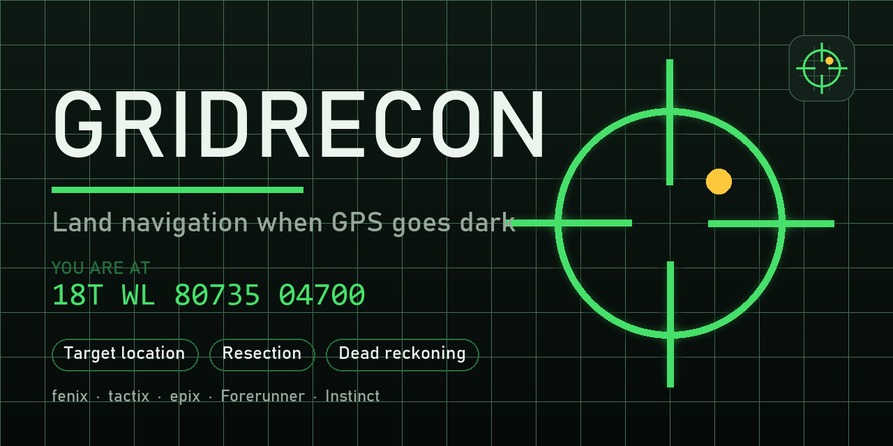

<div align="center">



# GridRecon

**A GPS-denied land-navigation toolkit for Garmin watches.**

Written in [Monkey C](https://developer.garmin.com/connect-iq/monkey-c/) for Connect IQ.

[](LICENSE)
[](https://developer.garmin.com/connect-iq/)
[](#-supported-devices)

</div>

---

GridRecon does the map-and-compass math your watch's built-in navigation doesn't.
Your firmware already handles GPS waypoints and MGRS display — GridRecon owns the
things you fall back on **when GPS is off, jammed, or you're training**: computing
a target's grid from a bearing and a range, and getting yourself back to a marked
spot. The point: you don't need a GPS fix *at the thing you're locating*.

It's built button-first for the **Fenix 8 Solar / tactix**, and the layout scales
cleanly from a 280×280 fenix down to a 156×156 monochrome Instinct.

---

## ✨ What it does

| Tool | What it's for |
|---|---|
| **Live position** | Your current location as a clean MGRS grid, auto-sized to your screen. |
| **Find a target** | Enter the bearing + distance to anything you can see → get its MGRS grid, plus the back-azimuth to walk yourself home. The classic observer "polar plot" / call-for-fire. |
| **Mark this spot** | Save where you are under a name (Car, Camp, Trailhead, …). Persisted, so it survives closing the app — that's the "where'd I park?" magic. |
| **Take me back** | Live navigation to a saved mark: a hybrid arrow (compass when still, GPS course when moving), the distance counting down, and the bearing as the always-true number. |
| **Manage marks** | Review and delete saved marks. |

Every screen is **button-labelled** — small hints sit right next to the physical
button that triggers them (e.g. `CONFIRM ►` by START), and number entry uses
**hold-to-repeat** so a big bearing isn't dozens of taps.

---

## 🧭 How "Find a target" works

It's the inverse of getting lost. Your watch knows where *you* are; GridRecon turns
a direction and a distance into where *something else* is:

1. **Your fix** — current position in WGS84 lat/lon.
2. **Your aim** — the bearing (true north) and range you read off a compass + laser/pace.
3. **Project** — a forward geodesic walks that distance along that bearing to the target's lat/lon.
4. **Convert** — UTM (transverse Mercator, WGS84) → a standard MGRS grid string.
5. **Result** — the target's grid + the back-azimuth (`bearing + 180°`).

Steps 3–5 use no satellites. The grid engine (`source/Geo.mc`) is validated to the
metre against the authoritative MGRS/GEOTRANS reference across both hemispheres.

> **Field note:** the bearing you enter is treated as **true north**. Either set
> your compass to a true-north reference, or apply your local declination first —
> at 1 km, 1° of error is ~17 m on the ground.

---

## 📐 Supported devices

Primary target is the **Fenix 8 Solar 51mm** (= tactix 8 Solar 51mm). The UI is laid
out relative to the screen and grids are drawn with a fit-to-width helper
(auto-shrink, then two-line fallback), so it stays legible everywhere from 280×280
down to a 156×156 1-bit Instinct — no per-device assets.

| Family | Devices |
|---|---|
| **fenix / tactix** | fenix 8 Solar 47/51mm, fenix 8 43/47mm, fenix 7 / 7S / 7X (+ Pro), fenix 6S / 6S Pro |
| **Instinct** | Instinct 2 / 2S / 2X, Instinct E (40/45), Instinct Crossover |
| **Forerunner** | FR 255S, FR 55 |

---

## 🛠️ Build & run

> **Prerequisites:** the [Connect IQ SDK](https://developer.garmin.com/connect-iq/sdk/),
> a JDK (17+), PowerShell, and a developer key (`developer_key.der`) in the repo
> root — see [CONTRIBUTING.md](CONTRIBUTING.md) to generate one. `build.ps1`
> auto-detects your SDK and JDK; override them in `build_config.json` if needed.

```powershell
./build.ps1                       # build the .prg (default: fenix8solar51mm)
./build.ps1 -Device instinct2s    # build a different device
./build.ps1 -Run                  # build, start the simulator if needed, and load
./build.ps1 -Export               # package a store-ready .iq
```

**Sideload to a watch:** build the `.prg`, connect the watch by USB (it mounts as a
drive), copy `bin/GridRecon.prg` to `GARMIN/APPS/`, eject, and launch GridRecon.

---

## 🗺️ Roadmap

The grid + navigation engine is the foundation for the rest of the GPS-denied toolkit:

- **Grid ↔ grid** — range and bearing between two entered grids.
- **Save a target as a mark** — drop the computed target straight into your marks.
- **Resection** — fix your own position from two or three compass bearings to known points.
- **Dead reckoning** — bearing + distance legs you can walk with GPS fully off.
- **Pace count** — accelerometer-driven distance, your pace beads automated.

---

## 🎨 Project layout

- `source/` — the app: `Geo.mc` (MGRS + geodesy engine), `Views.mc`, `Nav.mc`, `NumberInput.mc`, `ToolMenu.mc`, `Marks.mc`, `Draw.mc`.
- `resources/` — strings and the launcher icon.
- `tools/` — `gen_icon.py` / `gen_promo.py` generate the launcher icon and marketing art (Python + Pillow).
- `assets/` — generated icon and promo graphics.

---

## 🤝 Contributing

Contributions are welcome — see [CONTRIBUTING.md](CONTRIBUTING.md) for setup, coding
guidelines, and the PR process. By participating you agree to the
[Code of Conduct](CODE_OF_CONDUCT.md).

## 📄 License

Released under the [MIT License](LICENSE). © 2026 Christopher Fennell.

<div align="center"><sub>Know where you are. Know where it is. Even when GPS doesn't.</sub></div>
